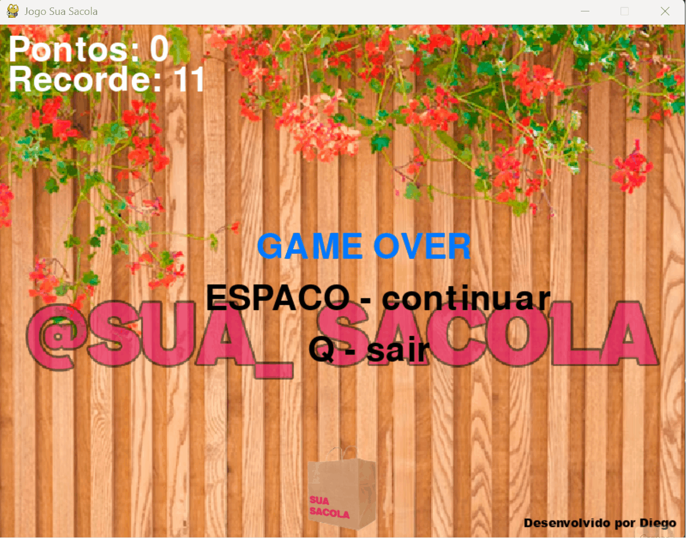

# Olá Mundo, eu sou o Diego Fonseca 👋

💻 **Desenvolvedor Back-end Júnior | Python e SQL Server**  
 🎓 _Pós-graduando em Arquitetura de Software, Ciência de Dados e Cybersecurity (PUCPR)_  
 📍 São Gonçalo, Rio de Janeiro - Brasil

[🌐 LinkedIn](https://www.linkedin.com/in/dev-diego-fonseca/) • [📧 diegofonsca.25@gmail.com](mailto:diegofonsca.25@gmail.com)

   

---

### 🚀 Sobre Mim

Sou graduado em Gestão da Tecnologia da Informação e estou em transição para o desenvolvimento back-end, vindo de 4 anos como designer gráfico. Isso me deu atenção a detalhe, prazos curtos e contato direto com o cliente.

Hoje estudo e pratico principalmente **Python, SQL e construção de APIs**, e busco minha primeira oportunidade como **desenvolvedor back-end júnior ou estágio**.

- 🎓 Graduado em **Gestão da Tecnologia da Informação**.
- 📚 Pós-graduando em **Arquitetura de Software, Ciência de Dados e Cybersecurity** (PUCPR, 2026–2027).
- 📜 Certificado **Professional Scrum Master I (PSM I)** pela Scrum.org.
- 📜 Certificado **SQL Server** pela Hashtag Treinamentos.

---

### 🛠️ Tecnologias & Ferramentas

- **Linguagens:** Python, JavaScript, HTML5, CSS3
- **Banco de dados:** SQL Server, SQL
- **Ferramentas & Metodologias:** Git, GitHub, Scrum (PSM I), Kanban

**Estudando agora:** FastAPI, PostgreSQL, Docker, testes automatizados com pytest e conceitos de arquitetura de software.

---

### 📌 Projetos em Destaque

|                       🍔 Fran-Burguer (Aplicação Web)                        |                       🛍️ Sua Sacola (Jogo 2D em Pygame)                       |
| :--------------------------------------------------------------------------: | :---------------------------------------------------------------------------: |
|  |  |
|      [🔗 Ver Repositório](https://github.com/DiegoFonsca/fran-burguer)       |        [🔗 Ver Repositório](https://github.com/DiegoFonsca/sua-sacola)        |

 

#### 🍕 [Dinn Pizzas](https://diegofonsca.github.io/DinPizzas/)

> **Cardápio digital para pizzaria**  
> Aplicação web responsiva, focada em design e usabilidade.

#### 🏥 [Clínica Médica](https://github.com/DiegoFonsca/clinica-medica)

> **Sistema de agendamento de consultas**  
> Projeto desenvolvido durante o curso Full Stack da Hashtag Treinamentos.

---

### 📫 Contato

Estou aberto a vagas de **desenvolvedor back-end júnior** e estágio. Se quiser trocar uma ideia sobre tecnologia ou carreira, me chama no [LinkedIn](https://www.linkedin.com/in/dev-diego-fonseca/).

---

### 📈 Estatísticas & Atividade

